<!-- Documentação do Projeto Duda Spa - Versão 1.0 -->

# 🧴 Duda Spa

<table>
  <tr>
    <td width="800px">
      <div align="justify">
        O <b>Duda Spa</b> é um sistema web de gerenciamento projetado especificamente para spas de beleza e bem-estar. Este projeto tem como objetivo digitalizar e centralizar as operações do estabelecimento, desde o agendamento online de clientes até o controle de comissões de funcionários, gestão financeira, estoque de produtos e administração de campanhas promocionais. A solução elimina processos manuais e ineficiências operacionais, garantindo maior produtividade para a equipe e uma experiência ágil para o cliente final.
      </div>
      <br>
      <b>Versão:</b> 1.0 <br>
      <b>Elaborado por:</b> Eduarda Vieira Gonçalves <br>
      <b>Contexto:</b> Trabalho final desenvolvido para a disciplina de <b>Projeto de Software</b> (4º período do curso de Engenharia de Software - PUC Minas). <br>
      <b>Data de Entrega:</b> 07/06/2026
    </td>
    <td>
      <div align="center">
        
      </div>
    </td>
  </tr> 
</table>

---

## 🚧 Status do Projeto

Abaixo estão os indicadores do status atual de desenvolvimento e integração do projeto de documentação e arquitetura:

[](#licença)


---

## 📚 Índice
- [🔗 Links Úteis](#-links-úteis)
- [1. Introdução](#1-introdução)
  - [1.1 Contextualização](#11-contextualização)
- [2. Modelos de Usuário e Requisitos](#2-modelos-de-usuário-e-requisitos)
  - [2.1 Descrição de Atores](#21-descrição-de-atores)
  - [2.2 Modelo de Casos de Uso e Histórias de Usuários](#22-modelo-de-casos-de-uso-e-histórias-de-usuários)
    - [2.2.1 Histórias de Usuário](#221-histórias-de-usuário)
    - [2.2.2 Casos de Uso](#222-casos-de-uso)
  - [2.3 Diagrama de Sequência do Sistema (DSS)](#23-diagrama-de-sequência-do-sistema-dss)
- [3. Modelos de Projeto](#3-modelos-de-projeto)
  - [3.1 Arquitetura do Sistema](#31-arquitetura-do-sistema)
  - [3.2 Diagrama de Componentes e Implantação](#32-diagrama-de-componentes-e-implantação)
  - [3.3 Diagrama de Classes](#33-diagrama-de-classes)
  - [3.4 Diagramas de Sequência por Caso de Uso](#34-diagramas-de-sequência-por-caso-de-uso)
  - [3.5 Diagramas de Comunicação](#35-diagramas-de-comunicação)
  - [3.6 Diagramas de Estados](#36-diagramas-de-estados)
- [4. Modelos de Dados](#4-modelos-de-dados)
- [🛠 Tecnologias Utilizadas](#-tecnologias-utilizadas)
- [🔧 Instalação e Execução](#-instalação-e-execução)
  - [Pré-requisitos](#pré-requisitos)
  - [🔑 Variáveis de Ambiente](#-variáveis-de-ambiente)
  - [📦 Instalação de Dependências](#-instalação-de-dependências)
  - [💾 Inicialização do Banco de Dados](#-inicialização-do-banco-de-dados-postgresql)
  - [⚡ Como Executar a Aplicação](#-como-executar-a-aplicação)
- [🚀 Deploy](#-deploy)
- [📂 Estrutura de Pastas](#-estrutura-de-pastas)
- [🧪 Testes](#-testes)
- [🔗 Documentações Utilizadas](#-documentações-utilizadas)
- [👥 Autores](#-autores)
- [🤝 Contribuição](#-contribuição)
- [🙏 Agradecimentos](#-agradecimentos)
- [📄 Licença](#-licença)

---

## 🔗 Links Úteis
* 📖 **Documentação de Requisitos e Visão:** [PDF - Duda Spa](Trabalho2-DocumentacaoProjeto.pdf)
* 📐 **Arquivos de Modelagem (PlantUML):** [Pasta de Diagramas (PUML)](diagramas)
* 🖼️ **Imagens de Diagramas Renderizados:** [Pasta de Imagens (PNG)](images)

---

## 1. Introdução
Este documento agrega: 1) a elaboração e revisão de modelos de domínio e 2) modelos de projeto para o sistema **Duda Spa**. A referência principal para a descrição geral do problema, domínio e requisitos do sistema é o documento de especificação que descreve a visão de domínio do sistema. Tal especificação acompanha este documento.

### 1.1 Contextualização
O atendimento em spas e espaços de beleza e bem-estar ainda depende amplamente de processos manuais: agendamentos feitos por telefone, controle de agenda em papel ou planilhas, cobranças sem registro centralizado e ausência de histórico digital dos atendimentos. Essas limitações geram ineficiências operacionais, erros de comunicação entre equipe e clientes, e dificuldades na gestão financeira do negócio.

Nesse contexto, surge o **Duda Spa**, um sistema web de gerenciamento voltado para spas de beleza e bem-estar, com o objetivo de digitalizar e centralizar os processos do estabelecimento. A solução oferece aos clientes uma experiência de agendamento prática e online, com visualização de serviços, promoções e profissionais disponíveis. Para a equipe interna, o sistema disponibiliza ferramentas eficientes para organização da agenda, registro de evoluções de atendimento e lançamento de comissões. Já para a gestão, centraliza o controle financeiro, o estoque de produtos e o gerenciamento de promoções e serviços.

O sistema contempla cinco perfis de usuário: o **Cliente**, que realiza e cancela agendamentos online; o **Funcionário**, que consulta sua agenda e registra os atendimentos; a **Recepcionista**, responsável pelo fluxo presencial de check-in e cobrança; o **Gerente**, que acompanha o desempenho financeiro e operacional; e o **Usuário**, perfil base do qual todos os demais herdam as funcionalidades de acesso ao sistema.

---

## 2. Modelos de Usuário e Requisitos
Esta seção tem como objetivo descrever os usuários e atores do sistema, assim como os requisitos aos quais ele deve atender. Para isso, é apresentada uma breve descrição de cada ator, seguida do diagrama de casos de uso e das histórias de usuário relacionadas, que servem de referência para o desenvolvimento do sistema. Por fim, são apresentados os diagramas de sequência do sistema e os contratos de operações, responsáveis por definir como os atores interagem com o sistema em cada fluxo principal.

### 2.1 Descrição de Atores

| Ator | Descrição |
|---|---|
| **Usuário** | Qualquer pessoa que acessa o sistema. Pode gerenciar sua conta, fazer login e recuperar senha. Todos os demais atores herdam deste. |
| **Cliente** | Usuário autenticado que consome os serviços do spa. Visualiza serviços, promoções e profissionais, consulta horários disponíveis e realiza ou cancela agendamentos. O pagamento é feito presencialmente no dia do atendimento. |
| **Funcionário** | Profissional do spa. Consulta sua agenda de atendimentos, registra a evolução dos clientes e lança suas comissões. |
| **Recepcionista** | Responsável pelo atendimento presencial. Cadastra clientes, gerencia os agendamentos da equipe (incluindo reagendamentos), localiza agendamentos de clientes, realiza check-ins e realiza a cobrança no dia do atendimento. |
| **Gerente** | Responsável pela gestão do negócio. Acompanha relatórios financeiros, controla o estoque de produtos e gerencia promoções e serviços. |

### 2.2 Modelo de Casos de Uso e Histórias de Usuários
Esta subseção tem como objetivo descrever os modelos de usuários desenvolvidos por meio da implementação de personas. As personas representam perfis fictícios baseados nos usuários reais do sistema, permitindo compreender melhor suas necessidades, objetivos e dificuldades durante a utilização do Duda Spa.

#### 👤 Persona 1: Mariana (Cliente)
* **Descrição:** Mariana tem 32 anos e trabalha como analista administrativa. Possui uma rotina corrida e procura momentos de relaxamento para cuidar da saúde e bem-estar. Utiliza frequentemente aplicativos para realizar agendamentos online e valoriza praticidade e rapidez nos serviços.
* **Dores:**
  * Dificuldade para agendar horários por telefone.
  * Falta de informações sobre serviços e profissionais disponíveis.
* **Objetivos:**
  * Agendar atendimentos de forma rápida.
  * Escolher profissionais com base em suas especialidades.
  * Acompanhar seus agendamentos facilmente.

#### 👤 Persona 2: Carlos (Massoterapeuta / Funcionário)
* **Descrição:** Carlos tem 29 anos e atua como massoterapeuta no spa. Atende diversos clientes diariamente e precisa manter sua agenda organizada para oferecer um atendimento de qualidade.
* **Dores:**
  * Dificuldade para acompanhar alterações na agenda.
  * Falta de histórico organizado dos atendimentos realizados.
* **Objetivos:**
  * Visualizar seus atendimentos de forma clara.
  * Registrar evoluções dos clientes rapidamente.

#### 👤 Persona 3: Fernanda (Recepcionista)
* **Descrição:** Fernanda tem 35 anos e é responsável pelo atendimento presencial do spa. Ela realiza check-ins, reagendamentos e cobranças diariamente.
* **Dores:**
  * Perda de tempo procurando agendamentos manualmente.
  * Erros em cobranças e registros.
* **Objetivos:**
  * Encontrar rapidamente informações dos clientes.
  * Agilizar check-ins e pagamentos.

#### 👤 Persona 4: Patrícia (Proprietária / Gerente)
* **Descrição:** Patrícia é proprietária do spa e acompanha indicadores financeiros e operacionais para apoiar a tomada de decisão.
* **Dores:**
  * Falta de visão consolidada do desempenho do negócio.
  * Dificuldade para controlar estoque e promoções.
* **Objetivos:**
  * Monitorar resultados financeiros.
  * Melhorar o controle operacional do spa.

---

#### 2.2.1 Histórias de Usuário

| ID | História de Usuário |
|---|---|
| **US-01** | Como usuário, quero gerenciar minha conta, podendo criar, editar e excluir meus dados, para manter minhas informações atualizadas e controlar meu acesso ao sistema. |
| **US-02** | Como usuário, quero fazer login com e-mail e senha, para acessar o sistema com segurança. |
| **US-03** | Como usuário, quero recuperar minha senha via e-mail, para recuperar o acesso à minha conta caso a esqueça. |
| **US-04** | Como cliente, quero visualizar os serviços disponíveis e promoções ativas, para escolher o que melhor atende às minhas necessidades. |
| **US-05** | Como cliente, quero visualizar os profissionais e suas especialidades, para escolher quem realizará meu atendimento. |
| **US-06** | Como cliente, quero consultar horários disponíveis, para planejar meu agendamento. |
| **US-07** | Como cliente, quero realizar um agendamento escolhendo serviço, profissional e horário, para garantir meu atendimento. |
| **US-08** | Como cliente, quero cancelar um agendamento com antecedência, para liberar o horário quando necessário. |
| **US-09** | Como cliente, quero consultar meu histórico de atendimentos, para acompanhar os serviços realizados. |
| **US-10** | Como funcionário, quero consultar minha agenda de atendimentos, para me organizar diariamente. |
| **US-11** | Como funcionário, quero registrar a evolução dos clientes após cada atendimento, para manter um histórico atualizado. |
| **US-12** | Como funcionário, quero visualizar informações básicas dos clientes, para personalizar o atendimento. |
| **US-13** | Como funcionário, quero lançar minhas comissões, para que minha remuneração seja calculada corretamente. |
| **US-14** | Como recepcionista, quero cadastrar novos clientes, para que possam utilizar os serviços do spa. |
| **US-15** | Como recepcionista, quero gerenciar os agendamentos da equipe, para manter a agenda organizada. |
| **US-16** | Como recepcionista, quero localizar rapidamente o agendamento de um cliente, para agilizar o atendimento presencial. |
| **US-17** | Como recepcionista, quero realizar o check-in do cliente, para confirmar sua chegada ao estabelecimento. |
| **US-18** | Como recepcionista, quero registrar o pagamento do atendimento, para concluir o processo de venda. |
| **US-19** | Como gerente, quero acompanhar relatórios financeiros, para monitorar o desempenho do spa. |
| **US-20** | Como gerente, quero controlar o estoque de produtos utilizados nos atendimentos, para evitar desperdícios e faltas. |
| **US-21** | Como gerente, quero cadastrar e atualizar serviços oferecidos pelo spa, para manter o catálogo atualizado. |
| **US-22** | Como gerente, quero criar e gerenciar promoções, para aumentar a atratividade dos serviços. |

---

#### 2.2.2 Casos de Uso

| ID | Caso de Uso | Ator |
|---|---|---|
| **UC-01** | Gerenciar Conta | Usuário |
| **UC-02** | Fazer Login | Usuário |
| **UC-03** | Recuperar Senha | Usuário |
| **UC-04** | Visualizar Serviços e Promoções | Cliente |
| **UC-05** | Visualizar Profissionais | Cliente |
| **UC-06** | Consultar Horários Disponíveis | Cliente |
| **UC-07** | Realizar Agendamento | Cliente |
| **UC-08** | Cancelar Agendamento | Cliente |
| **UC-09** | Consultar Histórico de Atendimentos | Cliente |
| **UC-10** | Consultar Agenda de Atendimentos | Funcionário |
| **UC-11** | Registrar Evolução do Cliente | Funcionário |
| **UC-12** | Visualizar Dados do Cliente | Funcionário |
| **UC-13** | Lançar Comissões | Funcionário |
| **UC-14** | Cadastrar Cliente | Recepcionista |
| **UC-15** | Gerenciar Agendamentos da Equipe | Recepcionista |
| **UC-16** | Localizar Agendamento do Cliente | Recepcionista |
| **UC-17** | Realizar Check-in | Recepcionista |
| **UC-18** | Registrar Pagamento | Recepcionista |
| **UC-19** | Acompanhar Relatórios Financeiros | Gerente |
| **UC-20** | Controlar Estoque de Produtos | Gerente |
| **UC-21** | Gerenciar Serviços | Gerente |
| **UC-22** | Gerenciar Promoções | Gerente |

#### 🗺️ Diagrama de Casos de Uso do Sistema
A seguir, é apresentado o mapeamento visual das interações dos atores com as fronteiras do sistema, detalhado no arquivo [uc-diagram.puml](diagramas/uc-diagram.puml).

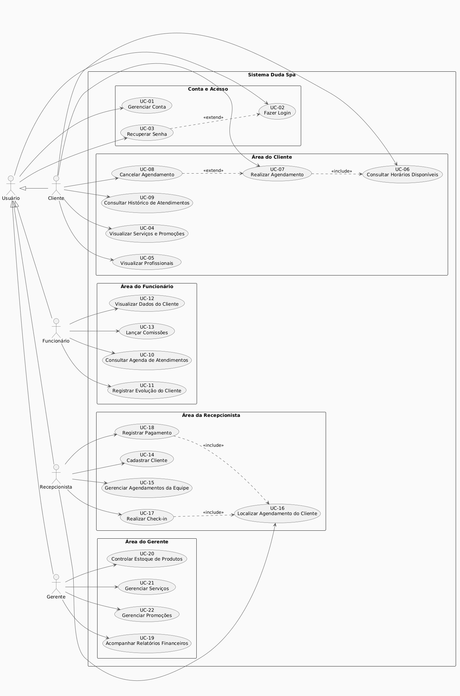

---

### 2.3 Diagrama de Sequência do Sistema (DSS)
O Diagrama de Sequência do Sistema (DSS) mapeia os eventos de entrada e saída gerados pelos atores em direção ao sistema. O fluxo geral consolida todas as interações principais descritas nos casos de uso. O arquivo de especificação original é o [geral-sequence-diagram.puml](diagramas/geral-sequence-diagram.puml).

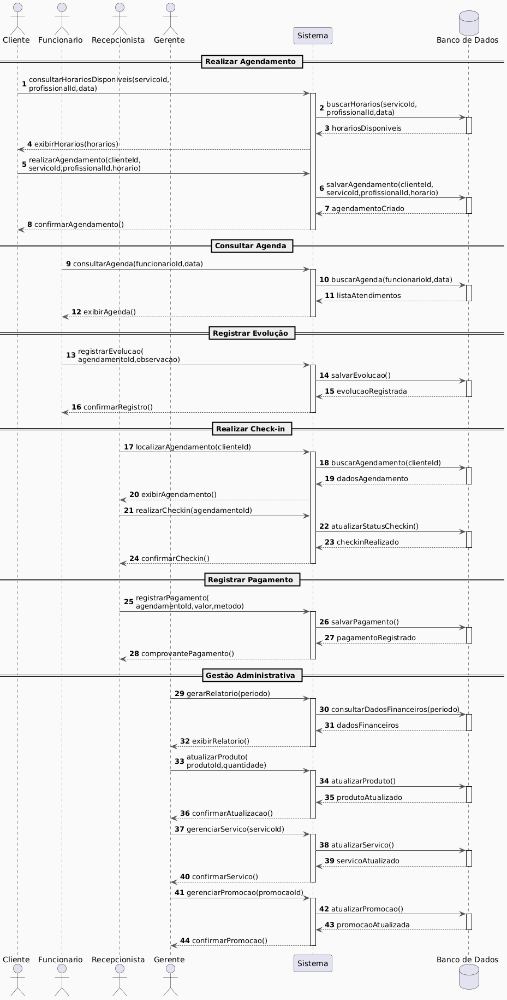

---

## 3. Modelos de Projeto

### 3.1 Arquitetura do Sistema
O sistema adota uma arquitetura limpa em camadas (Layered Architecture) para o Back-end, desenvolvida com o ecossistema Spring Boot, e arquitetura de componentes e rotas baseadas no Next.js (React) para o Frontend. A separação lógica é demonstrada no arquivo [architecture-diagram.puml](diagramas/architecture-diagram.puml):

* **Controller Layer:** Expõe endpoints REST, lidando com requisições HTTP, autorização básica e mapeando parâmetros de entrada para serviços.
* **DTO (Data Transfer Object):** Evita o acoplamento direto das entidades de banco de dados (`model`) com a API exposta ao cliente.
* **Service Layer:** Contém as regras de negócio e orquestração de transações do spa (como cálculo automático de comissões e verificação de conflitos de horários).
* **Repository Layer:** Camada de acesso a dados estendendo interfaces Spring Data JPA.
* **Model Layer:** Contém as entidades relacionais anotadas com JPA para persistência.
* **Security & Exception Config:** Filtros Spring Security (JWT) e tratamento centralizado de erros por exceções customizadas.

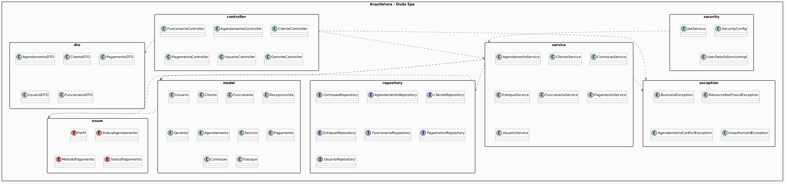

---

### 3.2 Diagrama de Componentes e Implantação
O Diagrama de Componentes e Implantação especifica a organização dos módulos do sistema e a infraestrutura física de nuvem proposta. Os diagramas originais são o [component-diagram.puml](diagramas/component-diagram.puml) e o [implantation-component.puml](diagramas/implantation-component.puml).

| Diagrama de Componentes | Diagrama de Implantação |
|:---:|:---:|
| 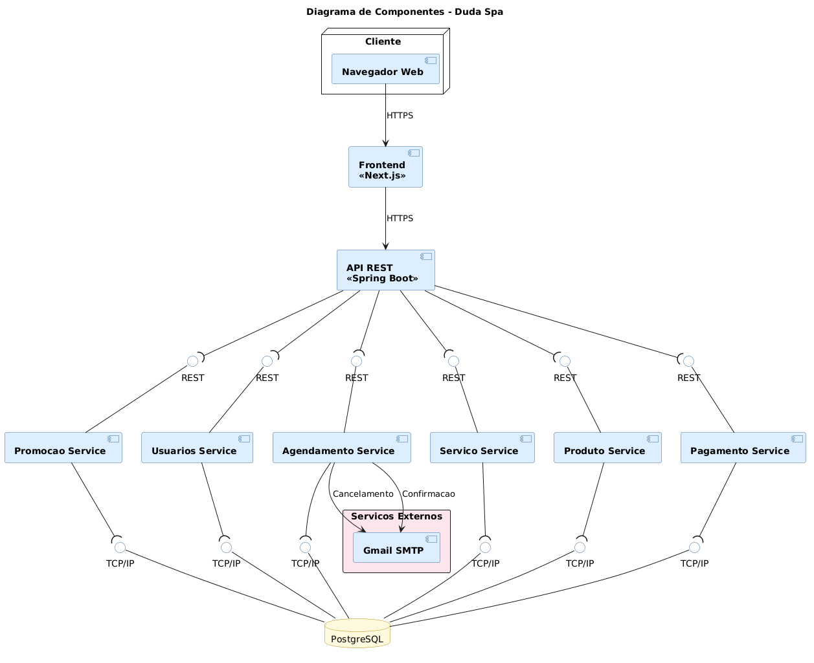 | 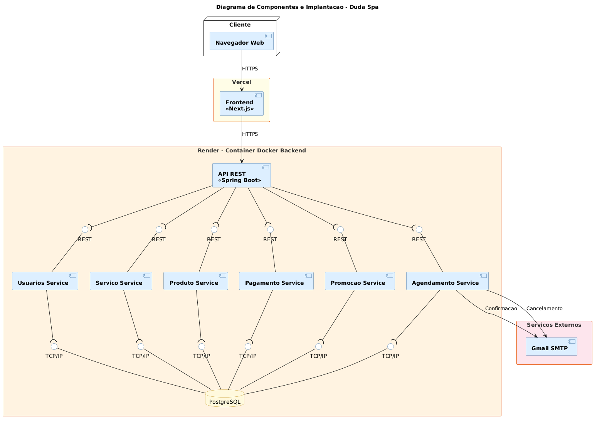 |

* **Frontend (Next.js):** Hospedado na **Vercel** para entrega rápida e responsiva das interfaces web.
* **Backend (Spring Boot REST API):** Encapsulado em um container Docker e executado na plataforma **Render**.
* **Banco de Dados (PostgreSQL):** Instância de banco de dados gerenciada e persistida integrada à nuvem.
* **Serviços Externos:** Integração SMTP do Gmail para notificações automáticas de confirmações e cancelamentos de agendamentos.

---

### 3.3 Diagrama de Classes
O Diagrama de Classes detalha os conceitos do domínio do spa, seus atributos, métodos e as associações estruturais (herança, agregação e multiplicidade), mapeado em [class-diagram.puml](diagramas/class-diagram.puml).

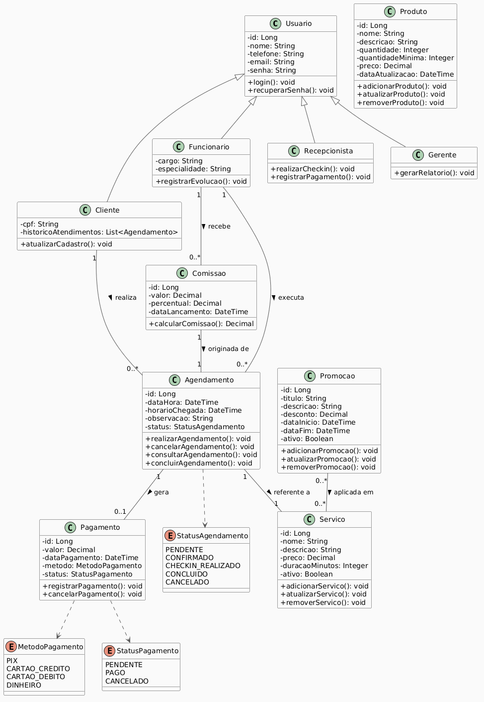

#### 📝 Principais Relações de Domínio:
* **Herança de Usuário:** `Cliente`, `Funcionario`, `Recepcionista` e `Gerente` herdam a estrutura básica de autenticação da classe `Usuario`.
* **Associações de Agendamento:** O `Agendamento` unifica as classes de domínio, associando um `Cliente` (quem realiza) unindo-o a um `Funcionario` (quem executa) e um `Servico` (o procedimento realizado).
* **Fluxo de Pagamento e Comissão:** Um `Agendamento` gera um `Pagamento` único. A conclusão do agendamento por parte do `Funcionario` gera uma `Comissao` associada proporcional ao percentual do profissional.
* **Gestão de Promoções:** A classe `Promocao` possui relacionamento de muitos-para-muitos (`*` para `*`) com `Servico`, representando descontos aplicáveis a múltiplos tratamentos do catálogo.

---

### 3.4 Diagramas de Sequência por Caso de Uso
Os Diagramas de Sequência mostram o comportamento dinâmico e a troca de mensagens entre os objetos do sistema em cenários específicos:

#### 1. UC-07: Realizar Agendamento ([puml](diagramas/sequence-diagrama-07.puml))
Demonstra as chamadas internas desde a consulta de horários e a validação de disponibilidade de profissionais pelo banco de dados até a inserção e confirmação da reserva.
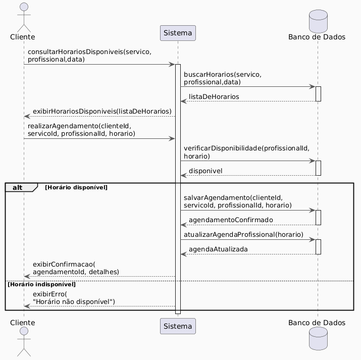

#### 2. UC-10: Consultar Agenda de Atendimentos ([puml](diagramas/sequence-diagram-10.puml))
Descreve a busca e recuperação de registros de atendimento do profissional para uma data específica no banco de dados.
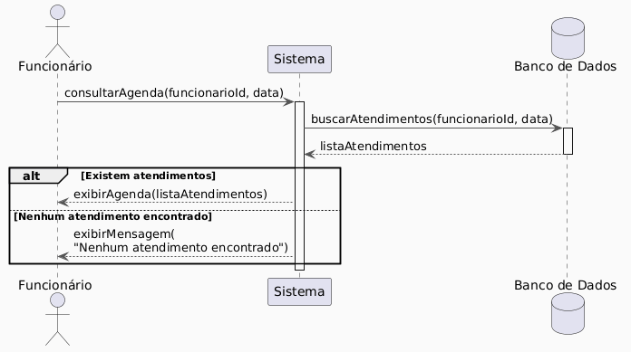

#### 3. UC-17: Realizar Check-in ([puml](diagramas/sequence-diagram-17.puml))
Exibe o fluxo executado pela recepcionista ao confirmar a chegada presencial de um cliente, atualizando o status do agendamento e registrando o timestamp do check-in.
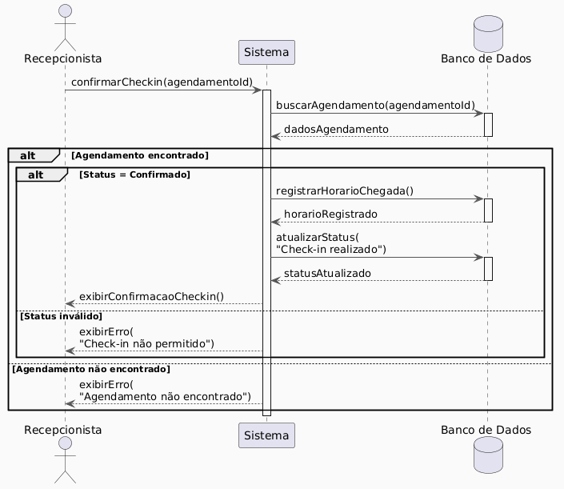

---

### 3.5 Diagramas de Comunicação
Os Diagramas de Comunicação (ou Colaboração) complementam a visão de dinâmica do projeto enfatizando a organização estrutural dos objetos que trocam mensagens:

#### 1. UC-07: Realizar Agendamento ([puml](diagramas/comunication-diagram-07.puml))
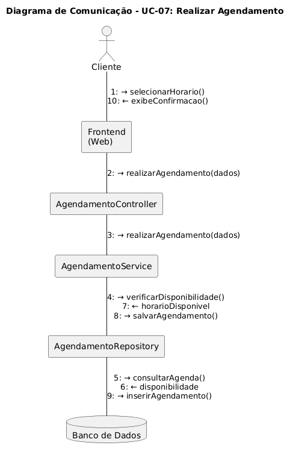

#### 2. UC-10: Consultar Agenda de Atendimentos ([puml](diagramas/comuncation-diagram-10.puml))
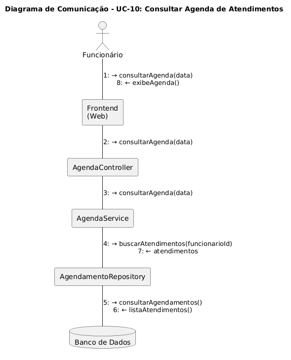

#### 3. UC-17: Realizar Check-in ([puml](diagramas/comuncation-diagram-17.puml))
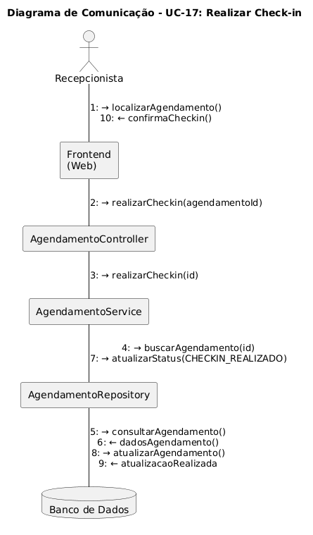

---

### 3.6 Diagramas de Estados
O Diagrama de Estados descreve o ciclo de vida de um `Agendamento` no Duda Spa, com base nas ações do cliente e da recepcionista. Mapeado no arquivo [state-diagram.puml](diagramas/state-diagram.puml).

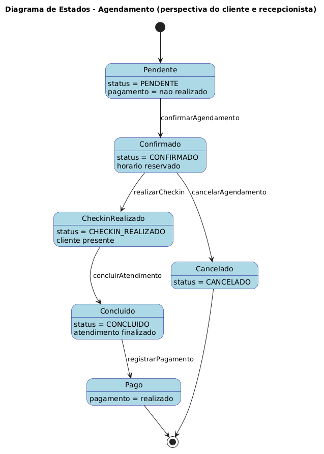

* **PENDENTE:** O agendamento é solicitado pelo cliente, aguardando validação ou confirmação de dados.
* **CONFIRMADO:** O horário do profissional é efetivamente reservado.
* **CANCELADO:** Transição de falha ou desistência, encerrando o fluxo.
* **CHECKIN_REALIZADO:** Ativado no dia do procedimento assim que a recepcionista valida a chegada do cliente.
* **CONCLUIDO:** O serviço foi executado com sucesso pelo funcionário.
* **PAGO:** Transição final bem-sucedida após a recepcionista confirmar o registro do pagamento físico/digital.

---

## 4. Modelos de Dados
O Modelo Lógico de Dados (Modelo Entidade-Relacionamento) mapeia a estrutura relacional idealizada para o banco PostgreSQL do spa. Detalhado no arquivo [er-diagram.puml](diagramas/er-diagram.puml).

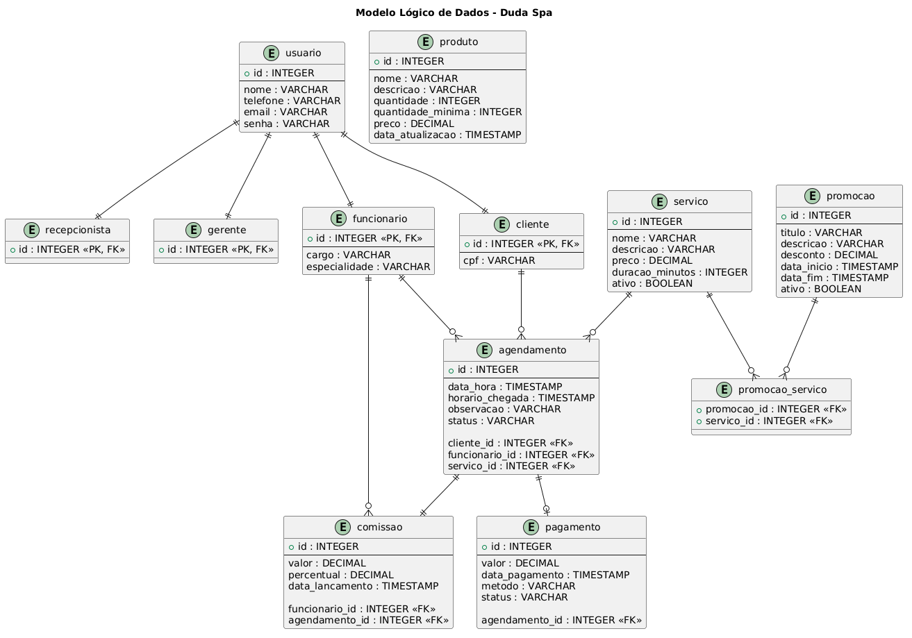

### 🗄️ Detalhes do Esquema Relacional:
* **Especialização de Usuários:** Adota-se o modelo de tabelas separadas com chaves estrangeiras compartilhadas como primárias (PK, FK) para `cliente`, `funcionario`, `recepcionista` e `gerente`, apontando para a tabela pai `usuario`.
* **Tabela `agendamento`:** Centraliza a relação de chaves estrangeiras (`cliente_id`, `funcionario_id`, `servico_id`).
* **Tabela `comissao`:** Vincula a comissão calculada tanto ao `funcionario` beneficiado quanto ao `agendamento` de origem.
* **Relação Muitos-para-Muitos:** Resolvida de forma ideal com a tabela associativa intermediária `promocao_servico` contendo chaves compostas FK (`promocao_id`, `servico_id`).

---

## 🛠 Tecnologias Utilizadas

Abaixo está o stack de tecnologias de referência projetado para o suporte e execução da aplicação Duda Spa:

### 💻 Front-end (Web)
* **Framework:** Next.js 14 (React)
* **Linguagem:** TypeScript
* **Estilização:** CSS Vanilla & Tailwind CSS
* **Biblioteca de UI:** shadcn/ui & Radix UI

### 🖥️ Back-end (API REST)
* **Linguagem/Runtime:** Java 17
* **Framework:** Spring Boot 3.x
* **Acesso ao Banco:** Spring Data JPA / Hibernate
* **Segurança:** Spring Security com Tokens stateless JWT

### ⚙️ Infraestrutura & DevOps
* **Banco de Dados:** PostgreSQL 16
* **Containerização:** Docker & Docker Compose
* **Serviços Cloud:** Vercel (Frontend), Render (Backend)

---

## 🔧 Instalação e Execução

### Pré-requisitos
Antes de executar a aplicação localmente, certifique-se de que possui as ferramentas abaixo instaladas no seu sistema:
* **Java JDK 17** ou superior.
* **Node.js LTS** (v18.x ou superior) com NPM/Yarn.
* **Docker Desktop** (opcional, recomendado para banco de dados).

---

### 🔑 Variáveis de Ambiente

#### 1. Back-end (`/backend/src/main/resources/application.yml`)
Configure as variáveis do banco de dados no seu ambiente ou use um arquivo `.env` na raiz do backend:
```env
SERVER_PORT=8080
SPRING_DATASOURCE_URL=jdbc:postgresql://localhost:5432/duda_spa_db
SPRING_DATASOURCE_USERNAME=postgres
SPRING_DATASOURCE_PASSWORD=suasenha_aqui
JWT_SECRET=duda_spa_super_secret_token_signature_key_2026
```

#### 2. Front-end (`/frontend/.env.local`)
Crie o arquivo na pasta do frontend para expor a URL da API:
```env
VITE_API_URL=http://localhost:8080/api
```

---

### 📦 Instalação de Dependências

1. Clone o repositório do projeto:
```bash
git clone https://github.com/eduardavieira-dev/Trabalho-final-projeto-de-software.git
cd Trabalho-final-projeto-de-software
```

2. Instale as dependências do **Front-end**:
```bash
cd frontend
npm install
cd ..
```

3. Compile e baixe as dependências do **Back-end**:
```bash
cd backend
./mvnw clean install
cd ..
```

---

### 💾 Inicialização do Banco de Dados (PostgreSQL)

Caso queira inicializar uma instância local rápida do banco de dados utilizando Docker, execute o comando a seguir:
```bash
docker run --name duda_spa_db -e POSTGRES_USER=postgres -e POSTGRES_PASSWORD=suasenha_aqui -e POSTGRES_DB=duda_spa_db -p 5432:5432 -d postgres:16
```
As migrações de banco (tabelas e cargas iniciais) serão criadas e executadas automaticamente pelo Hibernate/JPA assim que a API REST for iniciada em modo de desenvolvimento.

---

### ⚡ Como Executar a Aplicação

Execute a aplicação em dois terminais paralelos:

#### Terminal 1: Back-end (Spring Boot)
```bash
cd backend
./mvnw spring-boot:run
```
*A API REST estará rodando em: `http://localhost:8080`*

#### Terminal 2: Front-end (Next.js)
```bash
cd frontend
npm run dev
```
*O painel web estará disponível em: `http://localhost:3000` (ou `http://localhost:5173` conforme porta padrão do Vite)*

---

## 🚀 Deploy

O build final do sistema é gerado da seguinte forma:

```bash
# Build do Frontend (gera a pasta /dist ou pasta de exportação estática do Next.js)
cd frontend
npm run build

# Build do Backend (gera o arquivo JAR executável na pasta target/)
cd ../backend
./mvnw clean package
```

Para rodar os serviços construídos de forma integrada em ambiente de produção:
```bash
# Executando o servidor Java
java -jar backend/target/duda-spa-backend-0.0.1-SNAPSHOT.jar
```

---

## 📂 Estrutura de Pastas
A estrutura lógica proposta para organizar os artefatos de documentação, front-end, back-end e diagramas do projeto é apresentada a seguir:

```
.
├── README.md                           # Documentação principal do projeto
├── LICENSE                             # Arquivo de licença do projeto
├── Trabalho2-DocumentacaoProjeto.pdf   # Relatório oficial em PDF
│
├── /diagramas                          # Código fonte dos diagramas UML (PlantUML)
│   ├── uc-diagram.puml                 # Diagrama de Casos de Uso
│   ├── class-diagram.puml              # Diagrama de Classes
│   ├── er-diagram.puml                 # Diagrama de Entidade-Relacionamento
│   ├── architecture-diagram.puml       # Diagrama de Arquitetura estrutural
│   ├── component-diagram.puml          # Diagrama de Módulos de Componentes
│   ├── implantation-component.puml     # Diagrama de Componentes e Implantação
│   ├── geral-sequence-diagram.puml     # DSS Geral do Sistema
│   ├── sequence-diagrama-07.puml       # DSS - UC-07
│   ├── sequence-diagram-10.puml        # DSS - UC-10
│   ├── sequence-diagram-17.puml        # DSS - UC-17
│   ├── comunication-diagram-07.puml    # Diagrama de Comunicação - UC-07
│   ├── comuncation-diagram-10.puml     # Diagrama de Comunicação - UC-10
│   ├── comuncation-diagram-17.puml     # Diagrama de Comunicação - UC-17
│   └── state-diagram.puml              # Diagrama de Estados do Agendamento
│
├── /images                             # Diagramas exportados como imagens PNG e logo
│   ├── duda_spa_logo.png               # Logo oficial da marca Duda Spa
│   ├── use-case.png
│   ├── class-diagram.png
│   ├── er-diagram.png
│   ├── architecture.png
│   ├── component-diagram.png
│   ├── implantation-component.png
│   ├── geral-sequence-diagram.png
│   ├── sequence-diagrama-07.png
│   ├── sequence-diagram-10.png
│   ├── sequence-diagram-17.png
│   ├── comunication-diagram-07.png
│   ├── comuncation-diagram-10.png
│   ├── comuncation-diagram-17.png
│   └── state-diagram.png
│
├── /backend                            # Estrutura modular da API REST (Spring Boot)
│   ├── src/main/java/com/dudaspa/app   # Controladores, Entidades, Serviços e Repositórios
│   └── pom.xml                         # Dependências do Maven
│
└── /frontend                           # Estrutura do Frontend SPA/SSR (Next.js)
    ├── src/components                  # Componentes reutilizáveis de tela
    ├── src/pages                       # Telas principais de Clientes, Funcionários, Recepcionista e Gerente
    └── package.json                    # Scripts e bibliotecas Node.js
```

---

## 🧪 Testes

### Testes de Integração e Unitários (Back-end)
O backend Spring Boot foi projetado para rodar testes utilizando JUnit 5 e Mockito para simular as principais lógicas de comissão e validação de conflitos de agenda:
```bash
cd backend
./mvnw test
```

### Testes End-to-End (Frontend)
Para testes de interface E2E cobrindo o fluxo de agendamento do cliente e validações de check-in, propõe-se o uso do Cypress:
```bash
cd frontend
npm run test:e2e
```

---

## 🔗 Documentações Utilizadas
* [Documentação Oficial do Spring Boot](https://docs.spring.io/spring-boot/docs/current/reference/html/)
* [Documentação do Next.js (React)](https://nextjs.org/docs)
* [Manual do Usuário PlantUML](https://plantuml.com/pt-br/)
* [Especificação JPA & Hibernate](https://hibernate.org/orm/documentation/)
* [Padrão de Commits Semânticos (Conventional Commits)](https://www.conventionalcommits.org/pt-br/v1.0.0/)

---

## 👥 Autora

| 👤 Nome | 🖼️ Foto | :octocat: GitHub | 💼 LinkedIn | 📤 Gmail |
|---------|----------|-----------------|-------------|-----------|
| Eduarda Vieira Gonçalves | <div align="center"></div> | <div align="center"><a href="https://github.com/eduardavieira-dev"></a></div> | <div align="center"><a href="https://www.linkedin.com/in/eduarda-vieira-gon%C3%A7alves-01a584297/"></a></div> | <div align="center"><a href="mailto:eduarda.vieira.goncalves7@gmail.com"></a></div> |

---

## 🤝 Contribuição
1. Faça um `fork` do projeto.
2. Crie uma branch para sua funcionalidade: `git checkout -b feature/minha-feature`.
3. Commit suas alterações seguindo a padronização de Commits Semânticos: `git commit -m 'feat: adiciona fluxo de comissão customizada'`.
4. Envie a branch para o repositório remoto: `git push origin feature/minha-feature`.
5. Abra um **Pull Request (PR)** para revisão.

---

## 🙏 Agradecimentos
* **Engenharia de Software PUC Minas** – Pelo suporte institucional, infraestrutura de ensino e incentivo constante à excelência acadêmica na modelagem e desenvolvimento de sistemas reais de engenharia.
* **Prof. Dr. João Paulo Aramuni** – Pela docência de alto nível, dedicação pedagógica na disciplina de Projeto de Software e pelas diretrizes que estruturaram o desenvolvimento deste trabalho.

---

## 📄 Licença
Este projeto é distribuído sob a licença **MIT**. Veja o arquivo [LICENSE](LICENSE) para mais detalhes.
